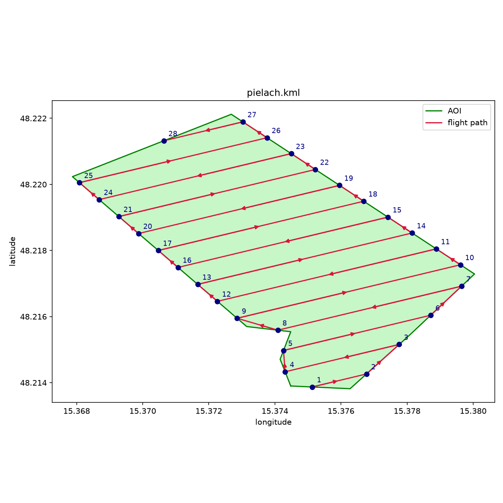

# UAV-LiDAR flight planning tool
A project written for the course Python-Programmierung für Geowissenschaften [120.113] @ TU Wien  
## Aim of the Project
The task  was to implement a simple tool to create flight plans for UAV-LiDAR surveys.  
The tool takes an area-of-interest polygon and basic flight mission parameters as input and returns a waypoint kml file as output.  
The tool is available as an importable module aswell as support for calls from the commandline and a QGIS processing script
## Features
- **Input**: an AOI polygon, given as a GeoJSON file (`.geojson`/`.json`) or Plaintext (lon;lat\n).
- **Planning**: the polygon is projected into a local metric coordinate system (UTM, auto-detected from the AOI's location unless an EPSG code is given), and flight lines are generated according to the chosen mission type:
   - **`single_grid`** : a back and forth raster across the AOI.
   - **`double_grid`** : two rasters orthogonal to each other for denser coverage.
   - **`corridor`** : follows the centerline of a long, narrow AOI (road, river, ...) instead of a straight raster, the flight tracks bends in the corridor and supports multiple parallel lines if the corridor is wider than one sensor swath (work in progress).
- **Metrics**: swath width, line spacing, number of lines, estimated point density, total flight length, and flight duration are computed and printed to the console.
- **Output**: the flight plan is exported as a KML file containing numbered waypoint placemarks and the full flight path as a line.
## Installation
### As Module
Clone the repository and run `python -m pip -e [path to the repo]` using the python environment you'd like to install the Module in. Alternatively drop the ./uavplanner/ Folder into the desired environments site-package directory and install the required dependecies manually:
- shapely
- simplekml
- pyproj
### As QGIS-processing-script
Inside QGIS open the Python Console and type `import pip; pip.main(['install', '-e', r'[path-to-repo]'])`.
After this add the `plan_flight_lines.py` file to the QGIS toolbox. 
## Usage
### Command Line
`python -m uavplanner [input] [options]`
| Option | Description |
|---|---|
| `input` (positional) | AOI polygon file (`.geojson`/`.json`/`.txt`) |
| `-o`, `--output` | Output KML path (default: `mission.kml`) |
| `--altitude` | Flying altitude in meters (required) |
| `--velocity` | Flight speed in m/s (required) |
| `--fov` | Scanner field of view, full angle in degrees (required) |
| `--azimuth` | Main flight direction in degrees clockwise from north, or `auto` (default) to pick the shortest path automatically |
| `--overlap` | Swath overlap as a fraction 0–1 (default: `0.3`) |
| `--lead-in` | Line extension on both ends in meters, for sensor warm-up (default: `0`) |
| `--mission` | Mission type: `single_grid`, `double_grid`, or `corridor` (default: `single_grid`) |
| `--prf` | Pulse repetition frequency in Hz, enables a point density estimate |
| `--epsg` | Projected EPSG code to use (default: automatically picked UTM zone) |
| `--restricted` | Keep transit paths between flight lines inside the AOI (no flying outside the polygon) |
### QGIS
1) Create a new shapefile layer with type Polygon
2) Draw a Polygon
3) Click on the script in the toolbox, input arguments and run
4) The result is saved as a kml file and reloaded onto the map

## Structure
```
uavplanner/
├── __init__.py        Marks uavplanner as a Python package
├── __main__.py        Imports and calls cli.main()
├── cli.py             Command-line argument parsing and console output
├── crs.py             Coordinate reference system handling (WGS84, projected UTM)
├── geometry.py        Core raster flight-line generation, automatic azimuth optimization, transit routing
├── metrics.py         Swath width, line spacing, point density, and parameter validation
├── missions.py        Mission type registry
├── planner_types.py   Data structures(MissionParams, Waypoint, FlightLine, Metrics, FlightPlan)
├── planner.py         Responsible for (validate, project, generate lines, route transits, compute metrics, export)
├── reader.py          AOI file readers (GeoJSON, plain-text coordinate lists)
├── routing.py         Handles AOIs with holes (work in progress)
└── writer.py          KML export
```
## Examples
```
python -m uavplanner .\sample_aoi\pielach.geojson -o pielach.kml --altitude 70 --velocity 15 --fov 70

OUTPUT:
mission type:         single_grid
flight azimuth:       70 deg (auto)
projected CRS:        EPSG:32633
swath width:          98.0 m
line spacing:         68.6 m
flight lines:         14
total length:         6882 m
est. duration:        7.6 min
```

## Trivia
Longitude and Latitude made us sad:(  
Without Dijkstra-Algorithm the drone flies mad. 
## Test
